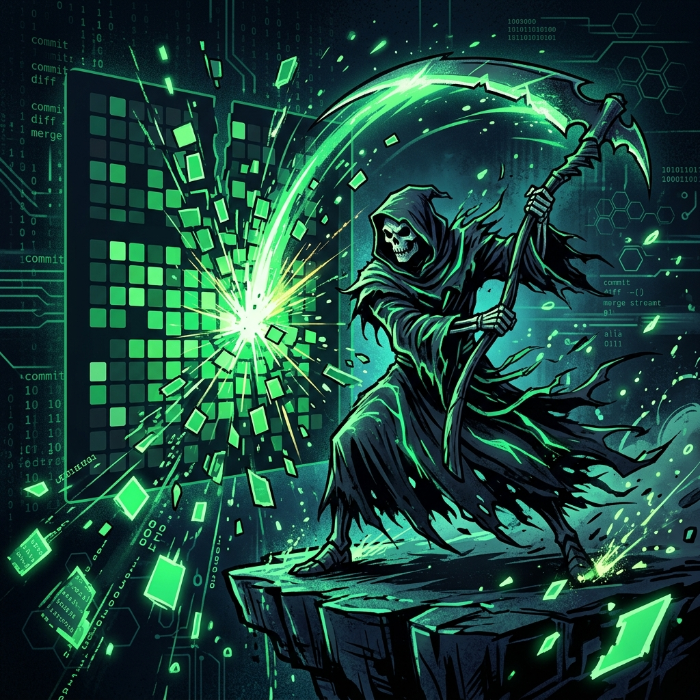

  

  
  
  

 

### 👨‍💻 Giới thiệu bản thân

- 🎓 Sinh viên chuyên ngành **Kỹ thuật Phần mềm (Software Engineering)**.
- 🌱 Đang học tập và phát triển các dự án liên quan đến **Java, C#, và Web Development (HTML/CSS/JS)**.
- 💡 Luôn mong muốn tìm tòi, học hỏi công nghệ mới và xây dựng các hệ thống hữu ích.
- 🎯 Mục tiêu: Trở thành một Software Engineer full-stack cứng cựa.
- ⚡ Fun fact: Code không bug chỉ tồn tại trong mơ, nhưng tôi luôn cố gắng biến giấc mơ đó thành sự thật!

 

### 🛠️ Kỹ năng & Công nghệ

  

 

### 📊 Thống kê GitHub

  
  

 

  

 

  <picture>
    <source media="(prefers-color-scheme: dark)" srcset="https://raw.githubusercontent.com/huystp/huystp/output/github-contribution-grid-snake-dark.svg">
    <source media="(prefers-color-scheme: light)" srcset="https://raw.githubusercontent.com/huystp/huystp/output/github-contribution-grid-snake.svg">
    
  </picture>

 

### 📈 Biểu đồ Hoạt Động

  

 

<!-- Footer wave -->

  

